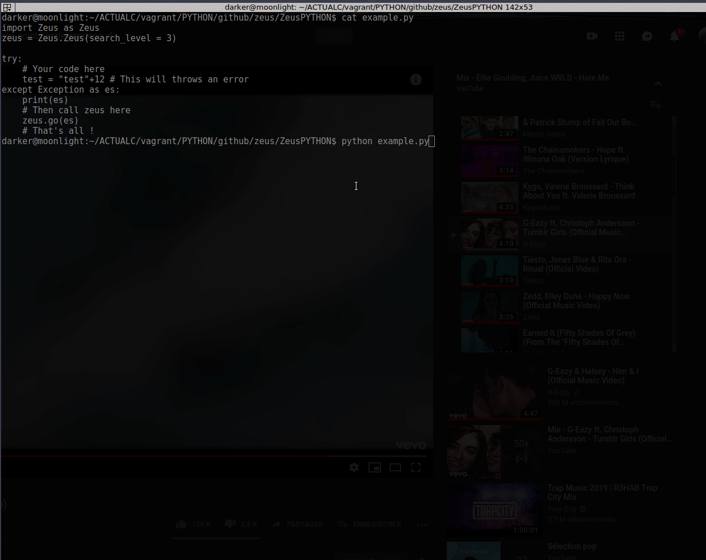

# Zeus

Never open a Browser-tab again, copy/Paste your error/Exception to find available solutions online randomly!\
Zeus will handle everything for you, directly in the CLI after catching an error!\
**AMAZING RIGHT ?**

## How it's works

Theese are steps :

- Zeus get your error and ask you, where you want to find solution
- You just need to enter number corresponding the forum you want to fetch answers
- That's all, Zeus will provide you the available questions matching your error, give you the answers, votes,...

YOU GET IT ?
No need to `copy the Exception`, `Minimize your terminal`, `Open the browser`, `Paste it on google or any searchEngine`, `Open multiple tabs per result`, `fetching where the solution of your problem could be`...

## Available versions of Zeus

For now Zeus can be use on :

- *[Stable]* Python
- *[On going]* Javascript(Es5)
- *[On going]* Javascript(Es5)
- *[On going]* React
- *[Not yet]* AngularJs
- *[On going]* NodeJs
- *[Not yet]* PHP
- *[Not yet]* Ruby
- *[Not yet]* Perl
- *[Not yet]* Java
- *[Not yet]* C
- *[Not yet]* C++
- *[Not yet]* C#
- *[Not yet]* Haskell
- *[Not yet]* Dart
- *[Not yet]* Kotlin

## Handled Forums

For Now, Zeus can find on:

- [Done]StackOverflow
- *[Not yet]* StackExchange
- *[Not yet]* Codeproject
- *[Not yet]* GroupsGoogle
- *[Not yet]* CodeRanch
- *[Not yet]* FindNerd
- *[Not yet]* SitePoint
- *[Not yet]* Teamtreehouse
- *[Not yet]* ycombinator
- *[Not yet]* Bytes
- *[Not yet]* Daniweb
- *[Not yet]* Dreamincode
- *[Not yet]* Pineapple
- *[Not yet]* lobste
- *[Not yet]* developershed
- *[Not yet]* xda-developers
- *[Not yet]* Codeguru
- *[Not yet]* ProgrammersHeaven
- *[Not yet]* Quora
- *[Not yet]* Designertalk
- *[Not yet]* Hashnode
- *[Not yet]* Codecall
- *[Not yet]* Reddit
- *[Not yet]* Hackr
- *[Not yet]* Webdeveloper

You will have the available list in `./list.json`

## How to use it

Let's see some examples on how to use it :

- In Python:

Make sure you have installed all requirements in ./python/requirements.txt, by running :
```shell
pip install -r requirements.txt
```

```python
# You import first Zeus Class
import Zeus as Zeus
# You instantiate
zeus = Zeus.Zeus(search_level = 10) # search_level is not required and as default it's 0

try:
    # Your code here
    test = 12/0 # This will throws an error
except Exception as es:
    # Then call zeus here
    zeus.go(es)
    # That's all !
```

Run in the cli :
```shell
cd ./python
python example.py
```

## DEMO



## Author

- [Sanix-darker]("https://github.com/sanix-darker")